House Prices Prediction


```python
import pandas as pd
import numpy as np


```


```python
df = pd.read_csv("dataset/train.csv")
display(df.head())
print("The dataset has ", df.shape[0], " rows and ", df.shape[1], " columns.")
```


<div>

<table border="1" class="dataframe">
  <thead>
    <tr style="text-align: right;">
      <th></th>
      <th>Id</th>
      <th>MSSubClass</th>
      <th>MSZoning</th>
      <th>LotFrontage</th>
      <th>LotArea</th>
      <th>Street</th>
      <th>Alley</th>
      <th>LotShape</th>
      <th>LandContour</th>
      <th>Utilities</th>
      <th>...</th>
      <th>PoolArea</th>
      <th>PoolQC</th>
      <th>Fence</th>
      <th>MiscFeature</th>
      <th>MiscVal</th>
      <th>MoSold</th>
      <th>YrSold</th>
      <th>SaleType</th>
      <th>SaleCondition</th>
      <th>SalePrice</th>
    </tr>
  </thead>
  <tbody>
    <tr>
      <th>0</th>
      <td>1</td>
      <td>60</td>
      <td>RL</td>
      <td>65.0</td>
      <td>8450</td>
      <td>Pave</td>
      <td>NaN</td>
      <td>Reg</td>
      <td>Lvl</td>
      <td>AllPub</td>
      <td>...</td>
      <td>0</td>
      <td>NaN</td>
      <td>NaN</td>
      <td>NaN</td>
      <td>0</td>
      <td>2</td>
      <td>2008</td>
      <td>WD</td>
      <td>Normal</td>
      <td>208500</td>
    </tr>
    <tr>
      <th>1</th>
      <td>2</td>
      <td>20</td>
      <td>RL</td>
      <td>80.0</td>
      <td>9600</td>
      <td>Pave</td>
      <td>NaN</td>
      <td>Reg</td>
      <td>Lvl</td>
      <td>AllPub</td>
      <td>...</td>
      <td>0</td>
      <td>NaN</td>
      <td>NaN</td>
      <td>NaN</td>
      <td>0</td>
      <td>5</td>
      <td>2007</td>
      <td>WD</td>
      <td>Normal</td>
      <td>181500</td>
    </tr>
    <tr>
      <th>2</th>
      <td>3</td>
      <td>60</td>
      <td>RL</td>
      <td>68.0</td>
      <td>11250</td>
      <td>Pave</td>
      <td>NaN</td>
      <td>IR1</td>
      <td>Lvl</td>
      <td>AllPub</td>
      <td>...</td>
      <td>0</td>
      <td>NaN</td>
      <td>NaN</td>
      <td>NaN</td>
      <td>0</td>
      <td>9</td>
      <td>2008</td>
      <td>WD</td>
      <td>Normal</td>
      <td>223500</td>
    </tr>
    <tr>
      <th>3</th>
      <td>4</td>
      <td>70</td>
      <td>RL</td>
      <td>60.0</td>
      <td>9550</td>
      <td>Pave</td>
      <td>NaN</td>
      <td>IR1</td>
      <td>Lvl</td>
      <td>AllPub</td>
      <td>...</td>
      <td>0</td>
      <td>NaN</td>
      <td>NaN</td>
      <td>NaN</td>
      <td>0</td>
      <td>2</td>
      <td>2006</td>
      <td>WD</td>
      <td>Abnorml</td>
      <td>140000</td>
    </tr>
    <tr>
      <th>4</th>
      <td>5</td>
      <td>60</td>
      <td>RL</td>
      <td>84.0</td>
      <td>14260</td>
      <td>Pave</td>
      <td>NaN</td>
      <td>IR1</td>
      <td>Lvl</td>
      <td>AllPub</td>
      <td>...</td>
      <td>0</td>
      <td>NaN</td>
      <td>NaN</td>
      <td>NaN</td>
      <td>0</td>
      <td>12</td>
      <td>2008</td>
      <td>WD</td>
      <td>Normal</td>
      <td>250000</td>
    </tr>
  </tbody>
</table>
<p>5 rows × 81 columns</p>
</div>


    The dataset has  1460  rows and  81  columns.
    


```python
display(df.info())

```


    RangeIndex: 1460 entries, 0 to 1459
    Data columns (total 81 columns):
     #   Column         Non-Null Count  Dtype  
    ---  ------         --------------  -----  
     0   Id             1460 non-null   int64  
     1   MSSubClass     1460 non-null   int64  
     2   MSZoning       1460 non-null   object 
     3   LotFrontage    1201 non-null   float64
     4   LotArea        1460 non-null   int64  
     5   Street         1460 non-null   object 
     6   Alley          91 non-null     object 
     7   LotShape       1460 non-null   object 
     8   LandContour    1460 non-null   object 
     9   Utilities      1460 non-null   object 
     10  LotConfig      1460 non-null   object 
     11  LandSlope      1460 non-null   object 
     12  Neighborhood   1460 non-null   object 
     13  Condition1     1460 non-null   object 
     14  Condition2     1460 non-null   object 
     15  BldgType       1460 non-null   object 
     16  HouseStyle     1460 non-null   object 
     17  OverallQual    1460 non-null   int64  
     18  OverallCond    1460 non-null   int64  
     19  YearBuilt      1460 non-null   int64  
     20  YearRemodAdd   1460 non-null   int64  
     21  RoofStyle      1460 non-null   object 
     22  RoofMatl       1460 non-null   object 
     23  Exterior1st    1460 non-null   object 
     24  Exterior2nd    1460 non-null   object 
     25  MasVnrType     1452 non-null   object 
     26  MasVnrArea     1452 non-null   float64
     27  ExterQual      1460 non-null   object 
     28  ExterCond      1460 non-null   object 
     29  Foundation     1460 non-null   object 
     30  BsmtQual       1423 non-null   object 
     31  BsmtCond       1423 non-null   object 
     32  BsmtExposure   1422 non-null   object 
     33  BsmtFinType1   1423 non-null   object 
     34  BsmtFinSF1     1460 non-null   int64  
     35  BsmtFinType2   1422 non-null   object 
     36  BsmtFinSF2     1460 non-null   int64  
     37  BsmtUnfSF      1460 non-null   int64  
     38  TotalBsmtSF    1460 non-null   int64  
     39  Heating        1460 non-null   object 
     40  HeatingQC      1460 non-null   object 
     41  CentralAir     1460 non-null   object 
     42  Electrical     1459 non-null   object 
     43  1stFlrSF       1460 non-null   int64  
     44  2ndFlrSF       1460 non-null   int64  
     45  LowQualFinSF   1460 non-null   int64  
     46  GrLivArea      1460 non-null   int64  
     47  BsmtFullBath   1460 non-null   int64  
     48  BsmtHalfBath   1460 non-null   int64  
     49  FullBath       1460 non-null   int64  
     50  HalfBath       1460 non-null   int64  
     51  BedroomAbvGr   1460 non-null   int64  
     52  KitchenAbvGr   1460 non-null   int64  
     53  KitchenQual    1460 non-null   object 
     54  TotRmsAbvGrd   1460 non-null   int64  
     55  Functional     1460 non-null   object 
     56  Fireplaces     1460 non-null   int64  
     57  FireplaceQu    770 non-null    object 
     58  GarageType     1379 non-null   object 
     59  GarageYrBlt    1379 non-null   float64
     60  GarageFinish   1379 non-null   object 
     61  GarageCars     1460 non-null   int64  
     62  GarageArea     1460 non-null   int64  
     63  GarageQual     1379 non-null   object 
     64  GarageCond     1379 non-null   object 
     65  PavedDrive     1460 non-null   object 
     66  WoodDeckSF     1460 non-null   int64  
     67  OpenPorchSF    1460 non-null   int64  
     68  EnclosedPorch  1460 non-null   int64  
     69  3SsnPorch      1460 non-null   int64  
     70  ScreenPorch    1460 non-null   int64  
     71  PoolArea       1460 non-null   int64  
     72  PoolQC         7 non-null      object 
     73  Fence          281 non-null    object 
     74  MiscFeature    54 non-null     object 
     75  MiscVal        1460 non-null   int64  
     76  MoSold         1460 non-null   int64  
     77  YrSold         1460 non-null   int64  
     78  SaleType       1460 non-null   object 
     79  SaleCondition  1460 non-null   object 
     80  SalePrice      1460 non-null   int64  
    dtypes: float64(3), int64(35), object(43)
    memory usage: 924.0+ KB
    


    None


The dataset might have many null values so let's check


```python
df.isnull().sum().sort_values(ascending=False)
```


    PoolQC         1453
    MiscFeature    1406
    Alley          1369
    Fence          1179
    FireplaceQu     690
                   ... 
    ExterQual         0
    Exterior2nd       0
    Exterior1st       0
    RoofMatl          0
    SalePrice         0
    Length: 81, dtype: int64


Let's take a statistical view


```python
df.describe()
```


<div>

<table border="1" class="dataframe">
  <thead>
    <tr style="text-align: right;">
      <th></th>
      <th>Id</th>
      <th>MSSubClass</th>
      <th>LotFrontage</th>
      <th>LotArea</th>
      <th>OverallQual</th>
      <th>OverallCond</th>
      <th>YearBuilt</th>
      <th>YearRemodAdd</th>
      <th>MasVnrArea</th>
      <th>BsmtFinSF1</th>
      <th>...</th>
      <th>WoodDeckSF</th>
      <th>OpenPorchSF</th>
      <th>EnclosedPorch</th>
      <th>3SsnPorch</th>
      <th>ScreenPorch</th>
      <th>PoolArea</th>
      <th>MiscVal</th>
      <th>MoSold</th>
      <th>YrSold</th>
      <th>SalePrice</th>
    </tr>
  </thead>
  <tbody>
    <tr>
      <th>count</th>
      <td>1460.000000</td>
      <td>1460.000000</td>
      <td>1201.000000</td>
      <td>1460.000000</td>
      <td>1460.000000</td>
      <td>1460.000000</td>
      <td>1460.000000</td>
      <td>1460.000000</td>
      <td>1452.000000</td>
      <td>1460.000000</td>
      <td>...</td>
      <td>1460.000000</td>
      <td>1460.000000</td>
      <td>1460.000000</td>
      <td>1460.000000</td>
      <td>1460.000000</td>
      <td>1460.000000</td>
      <td>1460.000000</td>
      <td>1460.000000</td>
      <td>1460.000000</td>
      <td>1460.000000</td>
    </tr>
    <tr>
      <th>mean</th>
      <td>730.500000</td>
      <td>56.897260</td>
      <td>70.049958</td>
      <td>10516.828082</td>
      <td>6.099315</td>
      <td>5.575342</td>
      <td>1971.267808</td>
      <td>1984.865753</td>
      <td>103.685262</td>
      <td>443.639726</td>
      <td>...</td>
      <td>94.244521</td>
      <td>46.660274</td>
      <td>21.954110</td>
      <td>3.409589</td>
      <td>15.060959</td>
      <td>2.758904</td>
      <td>43.489041</td>
      <td>6.321918</td>
      <td>2007.815753</td>
      <td>180921.195890</td>
    </tr>
    <tr>
      <th>std</th>
      <td>421.610009</td>
      <td>42.300571</td>
      <td>24.284752</td>
      <td>9981.264932</td>
      <td>1.382997</td>
      <td>1.112799</td>
      <td>30.202904</td>
      <td>20.645407</td>
      <td>181.066207</td>
      <td>456.098091</td>
      <td>...</td>
      <td>125.338794</td>
      <td>66.256028</td>
      <td>61.119149</td>
      <td>29.317331</td>
      <td>55.757415</td>
      <td>40.177307</td>
      <td>496.123024</td>
      <td>2.703626</td>
      <td>1.328095</td>
      <td>79442.502883</td>
    </tr>
    <tr>
      <th>min</th>
      <td>1.000000</td>
      <td>20.000000</td>
      <td>21.000000</td>
      <td>1300.000000</td>
      <td>1.000000</td>
      <td>1.000000</td>
      <td>1872.000000</td>
      <td>1950.000000</td>
      <td>0.000000</td>
      <td>0.000000</td>
      <td>...</td>
      <td>0.000000</td>
      <td>0.000000</td>
      <td>0.000000</td>
      <td>0.000000</td>
      <td>0.000000</td>
      <td>0.000000</td>
      <td>0.000000</td>
      <td>1.000000</td>
      <td>2006.000000</td>
      <td>34900.000000</td>
    </tr>
    <tr>
      <th>25%</th>
      <td>365.750000</td>
      <td>20.000000</td>
      <td>59.000000</td>
      <td>7553.500000</td>
      <td>5.000000</td>
      <td>5.000000</td>
      <td>1954.000000</td>
      <td>1967.000000</td>
      <td>0.000000</td>
      <td>0.000000</td>
      <td>...</td>
      <td>0.000000</td>
      <td>0.000000</td>
      <td>0.000000</td>
      <td>0.000000</td>
      <td>0.000000</td>
      <td>0.000000</td>
      <td>0.000000</td>
      <td>5.000000</td>
      <td>2007.000000</td>
      <td>129975.000000</td>
    </tr>
    <tr>
      <th>50%</th>
      <td>730.500000</td>
      <td>50.000000</td>
      <td>69.000000</td>
      <td>9478.500000</td>
      <td>6.000000</td>
      <td>5.000000</td>
      <td>1973.000000</td>
      <td>1994.000000</td>
      <td>0.000000</td>
      <td>383.500000</td>
      <td>...</td>
      <td>0.000000</td>
      <td>25.000000</td>
      <td>0.000000</td>
      <td>0.000000</td>
      <td>0.000000</td>
      <td>0.000000</td>
      <td>0.000000</td>
      <td>6.000000</td>
      <td>2008.000000</td>
      <td>163000.000000</td>
    </tr>
    <tr>
      <th>75%</th>
      <td>1095.250000</td>
      <td>70.000000</td>
      <td>80.000000</td>
      <td>11601.500000</td>
      <td>7.000000</td>
      <td>6.000000</td>
      <td>2000.000000</td>
      <td>2004.000000</td>
      <td>166.000000</td>
      <td>712.250000</td>
      <td>...</td>
      <td>168.000000</td>
      <td>68.000000</td>
      <td>0.000000</td>
      <td>0.000000</td>
      <td>0.000000</td>
      <td>0.000000</td>
      <td>0.000000</td>
      <td>8.000000</td>
      <td>2009.000000</td>
      <td>214000.000000</td>
    </tr>
    <tr>
      <th>max</th>
      <td>1460.000000</td>
      <td>190.000000</td>
      <td>313.000000</td>
      <td>215245.000000</td>
      <td>10.000000</td>
      <td>9.000000</td>
      <td>2010.000000</td>
      <td>2010.000000</td>
      <td>1600.000000</td>
      <td>5644.000000</td>
      <td>...</td>
      <td>857.000000</td>
      <td>547.000000</td>
      <td>552.000000</td>
      <td>508.000000</td>
      <td>480.000000</td>
      <td>738.000000</td>
      <td>15500.000000</td>
      <td>12.000000</td>
      <td>2010.000000</td>
      <td>755000.000000</td>
    </tr>
  </tbody>
</table>
<p>8 rows × 38 columns</p>
</div>


As we can see, there are many outliers in this dataset


```python
import matplotlib as plt
import seaborn as sns
```


```python
sns.histplot(df["SalePrice"], kde = True)
```


    
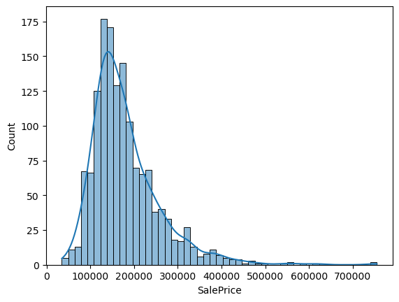
    


So the SalePrice, which is the output we are concerned about, is right skewed. We need to apply log transformation later.


```python
corr = df.corr()
display(corr[:6])
```


<div>

<table border="1" class="dataframe">
  <thead>
    <tr style="text-align: right;">
      <th></th>
      <th>Id</th>
      <th>MSSubClass</th>
      <th>LotFrontage</th>
      <th>LotArea</th>
      <th>OverallQual</th>
      <th>OverallCond</th>
      <th>YearBuilt</th>
      <th>YearRemodAdd</th>
      <th>MasVnrArea</th>
      <th>BsmtFinSF1</th>
      <th>...</th>
      <th>WoodDeckSF</th>
      <th>OpenPorchSF</th>
      <th>EnclosedPorch</th>
      <th>3SsnPorch</th>
      <th>ScreenPorch</th>
      <th>PoolArea</th>
      <th>MiscVal</th>
      <th>MoSold</th>
      <th>YrSold</th>
      <th>SalePrice</th>
    </tr>
  </thead>
  <tbody>
    <tr>
      <th>Id</th>
      <td>1.000000</td>
      <td>0.011156</td>
      <td>-0.010601</td>
      <td>-0.033226</td>
      <td>-0.028365</td>
      <td>0.012609</td>
      <td>-0.012713</td>
      <td>-0.021998</td>
      <td>-0.050298</td>
      <td>-0.005024</td>
      <td>...</td>
      <td>-0.029643</td>
      <td>-0.000477</td>
      <td>0.002889</td>
      <td>-0.046635</td>
      <td>0.001330</td>
      <td>0.057044</td>
      <td>-0.006242</td>
      <td>0.021172</td>
      <td>0.000712</td>
      <td>-0.021917</td>
    </tr>
    <tr>
      <th>MSSubClass</th>
      <td>0.011156</td>
      <td>1.000000</td>
      <td>-0.386347</td>
      <td>-0.139781</td>
      <td>0.032628</td>
      <td>-0.059316</td>
      <td>0.027850</td>
      <td>0.040581</td>
      <td>0.022936</td>
      <td>-0.069836</td>
      <td>...</td>
      <td>-0.012579</td>
      <td>-0.006100</td>
      <td>-0.012037</td>
      <td>-0.043825</td>
      <td>-0.026030</td>
      <td>0.008283</td>
      <td>-0.007683</td>
      <td>-0.013585</td>
      <td>-0.021407</td>
      <td>-0.084284</td>
    </tr>
    <tr>
      <th>LotFrontage</th>
      <td>-0.010601</td>
      <td>-0.386347</td>
      <td>1.000000</td>
      <td>0.426095</td>
      <td>0.251646</td>
      <td>-0.059213</td>
      <td>0.123349</td>
      <td>0.088866</td>
      <td>0.193458</td>
      <td>0.233633</td>
      <td>...</td>
      <td>0.088521</td>
      <td>0.151972</td>
      <td>0.010700</td>
      <td>0.070029</td>
      <td>0.041383</td>
      <td>0.206167</td>
      <td>0.003368</td>
      <td>0.011200</td>
      <td>0.007450</td>
      <td>0.351799</td>
    </tr>
    <tr>
      <th>LotArea</th>
      <td>-0.033226</td>
      <td>-0.139781</td>
      <td>0.426095</td>
      <td>1.000000</td>
      <td>0.105806</td>
      <td>-0.005636</td>
      <td>0.014228</td>
      <td>0.013788</td>
      <td>0.104160</td>
      <td>0.214103</td>
      <td>...</td>
      <td>0.171698</td>
      <td>0.084774</td>
      <td>-0.018340</td>
      <td>0.020423</td>
      <td>0.043160</td>
      <td>0.077672</td>
      <td>0.038068</td>
      <td>0.001205</td>
      <td>-0.014261</td>
      <td>0.263843</td>
    </tr>
    <tr>
      <th>OverallQual</th>
      <td>-0.028365</td>
      <td>0.032628</td>
      <td>0.251646</td>
      <td>0.105806</td>
      <td>1.000000</td>
      <td>-0.091932</td>
      <td>0.572323</td>
      <td>0.550684</td>
      <td>0.411876</td>
      <td>0.239666</td>
      <td>...</td>
      <td>0.238923</td>
      <td>0.308819</td>
      <td>-0.113937</td>
      <td>0.030371</td>
      <td>0.064886</td>
      <td>0.065166</td>
      <td>-0.031406</td>
      <td>0.070815</td>
      <td>-0.027347</td>
      <td>0.790982</td>
    </tr>
    <tr>
      <th>OverallCond</th>
      <td>0.012609</td>
      <td>-0.059316</td>
      <td>-0.059213</td>
      <td>-0.005636</td>
      <td>-0.091932</td>
      <td>1.000000</td>
      <td>-0.375983</td>
      <td>0.073741</td>
      <td>-0.128101</td>
      <td>-0.046231</td>
      <td>...</td>
      <td>-0.003334</td>
      <td>-0.032589</td>
      <td>0.070356</td>
      <td>0.025504</td>
      <td>0.054811</td>
      <td>-0.001985</td>
      <td>0.068777</td>
      <td>-0.003511</td>
      <td>0.043950</td>
      <td>-0.077856</td>
    </tr>
  </tbody>
</table>
<p>6 rows × 38 columns</p>
</div>


```python
sns.heatmap(corr[["SalePrice"]].sort_values(by="SalePrice", ascending= False))
```


    
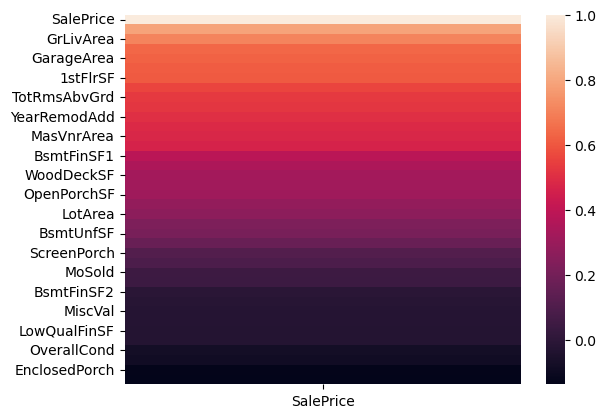
    


We have GrLivArea, GarageArea, 1stFlrSF with strong correlation, so let's plot them against SalePrice 


```python
sns.scatterplot(x="GrLivArea", y = "SalePrice", data=df)
```


    
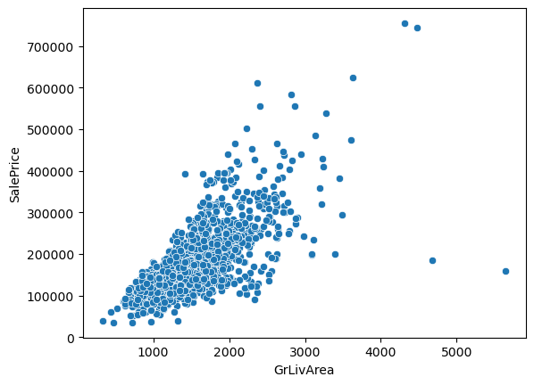
    


```python
sns.scatterplot(x="GarageArea", y = "SalePrice", data=df)
```


    
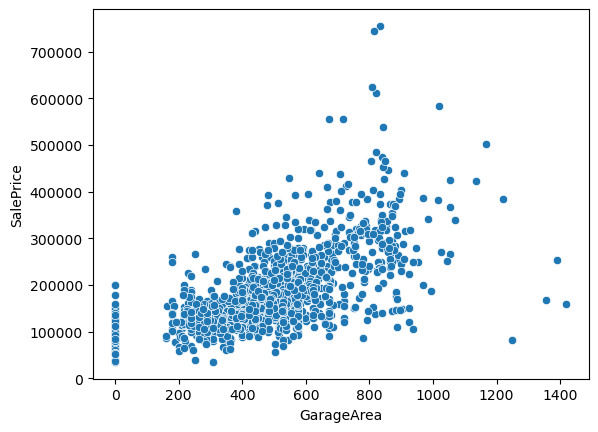
    


```python
sns.scatterplot(x="1stFlrSF", y = "SalePrice", data=df)
```


    
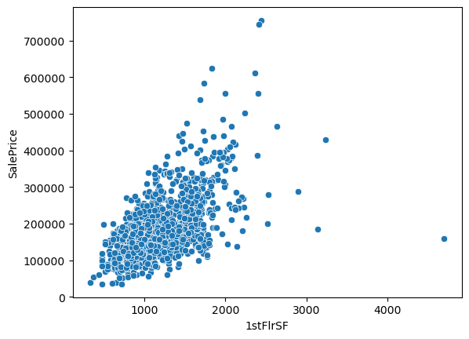
    


It seems like there is a linear relationship in all plots


```python
sns.boxplot(x = "OverallQual", y = "SalePrice", data = df)
```


    
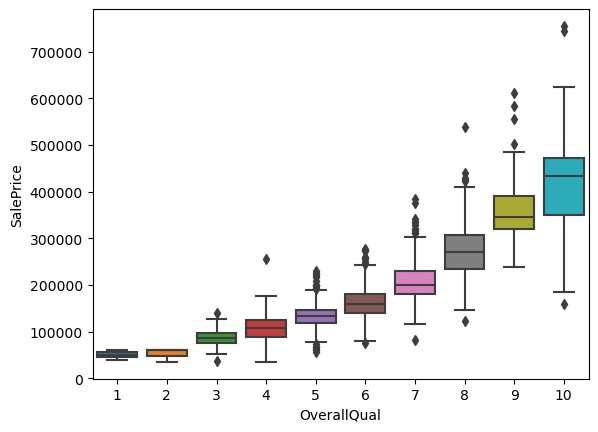
    


We can see here in this boxplot choosing a random feature "OverallQuell", we have some outliers.
Also, it seems like the OverallQual is proportionally linear with SalePrice.


```python
df.select_dtypes(include="object").head()

```


<div>

<table border="1" class="dataframe">
  <thead>
    <tr style="text-align: right;">
      <th></th>
      <th>MSZoning</th>
      <th>Street</th>
      <th>Alley</th>
      <th>LotShape</th>
      <th>LandContour</th>
      <th>Utilities</th>
      <th>LotConfig</th>
      <th>LandSlope</th>
      <th>Neighborhood</th>
      <th>Condition1</th>
      <th>...</th>
      <th>GarageType</th>
      <th>GarageFinish</th>
      <th>GarageQual</th>
      <th>GarageCond</th>
      <th>PavedDrive</th>
      <th>PoolQC</th>
      <th>Fence</th>
      <th>MiscFeature</th>
      <th>SaleType</th>
      <th>SaleCondition</th>
    </tr>
  </thead>
  <tbody>
    <tr>
      <th>0</th>
      <td>RL</td>
      <td>Pave</td>
      <td>NaN</td>
      <td>Reg</td>
      <td>Lvl</td>
      <td>AllPub</td>
      <td>Inside</td>
      <td>Gtl</td>
      <td>CollgCr</td>
      <td>Norm</td>
      <td>...</td>
      <td>Attchd</td>
      <td>RFn</td>
      <td>TA</td>
      <td>TA</td>
      <td>Y</td>
      <td>NaN</td>
      <td>NaN</td>
      <td>NaN</td>
      <td>WD</td>
      <td>Normal</td>
    </tr>
    <tr>
      <th>1</th>
      <td>RL</td>
      <td>Pave</td>
      <td>NaN</td>
      <td>Reg</td>
      <td>Lvl</td>
      <td>AllPub</td>
      <td>FR2</td>
      <td>Gtl</td>
      <td>Veenker</td>
      <td>Feedr</td>
      <td>...</td>
      <td>Attchd</td>
      <td>RFn</td>
      <td>TA</td>
      <td>TA</td>
      <td>Y</td>
      <td>NaN</td>
      <td>NaN</td>
      <td>NaN</td>
      <td>WD</td>
      <td>Normal</td>
    </tr>
    <tr>
      <th>2</th>
      <td>RL</td>
      <td>Pave</td>
      <td>NaN</td>
      <td>IR1</td>
      <td>Lvl</td>
      <td>AllPub</td>
      <td>Inside</td>
      <td>Gtl</td>
      <td>CollgCr</td>
      <td>Norm</td>
      <td>...</td>
      <td>Attchd</td>
      <td>RFn</td>
      <td>TA</td>
      <td>TA</td>
      <td>Y</td>
      <td>NaN</td>
      <td>NaN</td>
      <td>NaN</td>
      <td>WD</td>
      <td>Normal</td>
    </tr>
    <tr>
      <th>3</th>
      <td>RL</td>
      <td>Pave</td>
      <td>NaN</td>
      <td>IR1</td>
      <td>Lvl</td>
      <td>AllPub</td>
      <td>Corner</td>
      <td>Gtl</td>
      <td>Crawfor</td>
      <td>Norm</td>
      <td>...</td>
      <td>Detchd</td>
      <td>Unf</td>
      <td>TA</td>
      <td>TA</td>
      <td>Y</td>
      <td>NaN</td>
      <td>NaN</td>
      <td>NaN</td>
      <td>WD</td>
      <td>Abnorml</td>
    </tr>
    <tr>
      <th>4</th>
      <td>RL</td>
      <td>Pave</td>
      <td>NaN</td>
      <td>IR1</td>
      <td>Lvl</td>
      <td>AllPub</td>
      <td>FR2</td>
      <td>Gtl</td>
      <td>NoRidge</td>
      <td>Norm</td>
      <td>...</td>
      <td>Attchd</td>
      <td>RFn</td>
      <td>TA</td>
      <td>TA</td>
      <td>Y</td>
      <td>NaN</td>
      <td>NaN</td>
      <td>NaN</td>
      <td>WD</td>
      <td>Normal</td>
    </tr>
  </tbody>
</table>
<p>5 rows × 43 columns</p>
</div>


Let's choose SaleCondition


```python
sns.boxplot(x = "SaleCondition", y = "SalePrice", data = df)
```


    
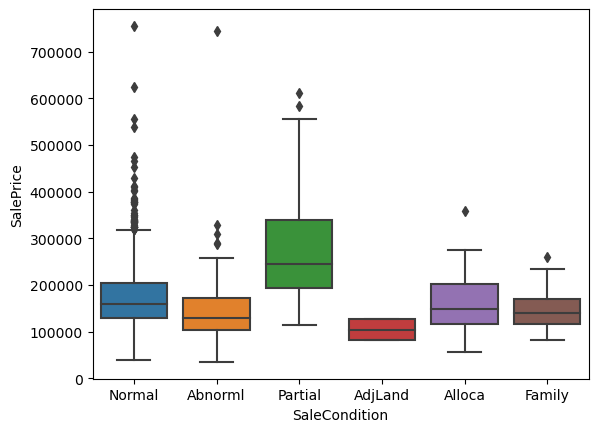
    


<p>We can notice that houses with partial sale condition tend to have higher sale prices than other sale conditions.</p> <p>Also, there are many outliers in the Normal category.</p>

Now let's use the Z-score and IQR methods to determine outliers.


```python
from scipy.stats import zscore

z_scores = zscore(df["SalePrice"])
outliers = df["SalePrice"][abs(z_scores) > 3]
outliers
```


    58      438780
    178     501837
    185     475000
    349     437154
    389     426000
    440     555000
    473     440000
    496     430000
    527     446261
    591     451950
    664     423000
    691     755000
    769     538000
    798     485000
    803     582933
    898     611657
    1046    556581
    1142    424870
    1169    625000
    1182    745000
    1243    465000
    1373    466500
    Name: SalePrice, dtype: int64


```python
Q1 = df["SalePrice"].quantile(0.25)
Q3 = df["SalePrice"].quantile(0.75)

IQR = Q3 - Q1

outliers = df["SalePrice"][(df["SalePrice"] < (Q1 - IQR*1.5)) | (df["SalePrice"] > (Q3 + IQR*1.5))]
outliers
```


    11      345000
    53      385000
    58      438780
    112     383970
    151     372402
             ...  
    1268    381000
    1353    410000
    1373    466500
    1388    377500
    1437    394617
    Name: SalePrice, Length: 61, dtype: int64


The results are different because two different methods are used.

Now let's clean our dataset starting with the outliers.


```python
df.isnull().sum().sort_values().tail(15)
```


    BsmtCond          37
    BsmtFinType1      37
    BsmtFinType2      38
    BsmtExposure      38
    GarageQual        81
    GarageFinish      81
    GarageYrBlt       81
    GarageType        81
    GarageCond        81
    LotFrontage      259
    FireplaceQu      690
    Fence           1179
    Alley           1369
    MiscFeature     1406
    PoolQC          1453
    dtype: int64


Since we have 1460 records, let's drop last 


```python
df = df.drop(columns = ["PoolQC","MiscFeature","Alley","Fence","FireplaceQu"])
```

Let's explore some other variables' values


```python
display(df["LotFrontage"].unique())
display(df["GarageCond"].unique())
```


    array([ 65.,  80.,  68.,  60.,  84.,  85.,  75.,  nan,  51.,  50.,  70.,
            91.,  72.,  66., 101.,  57.,  44., 110.,  98.,  47., 108., 112.,
            74., 115.,  61.,  48.,  33.,  52., 100.,  24.,  89.,  63.,  76.,
            81.,  95.,  69.,  21.,  32.,  78., 121., 122.,  40., 105.,  73.,
            77.,  64.,  94.,  34.,  90.,  55.,  88.,  82.,  71., 120., 107.,
            92., 134.,  62.,  86., 141.,  97.,  54.,  41.,  79., 174.,  99.,
            67.,  83.,  43., 103.,  93.,  30., 129., 140.,  35.,  37., 118.,
            87., 116., 150., 111.,  49.,  96.,  59.,  36.,  56., 102.,  58.,
            38., 109., 130.,  53., 137.,  45., 106., 104.,  42.,  39., 144.,
           114., 128., 149., 313., 168., 182., 138., 160., 152., 124., 153.,
            46.])


    array(['TA', 'Fa', nan, 'Gd', 'Po', 'Ex'], dtype=object)


```python
nulls = df.isnull().sum()
have_null = nulls.sort_values()[nulls > 0]

columns = have_null.index

int_columns = [col for col in columns if df[col].dtype != np.object_]

str_columns = [col for col in columns if df[col].dtype == np.object_]
display(int_columns)
display(str_columns)
```


    ['MasVnrArea', 'GarageYrBlt', 'LotFrontage']


    ['Electrical',
     'MasVnrType',
     'BsmtQual',
     'BsmtCond',
     'BsmtFinType1',
     'BsmtFinType2',
     'BsmtExposure',
     'GarageQual',
     'GarageCond',
     'GarageType',
     'GarageFinish']


```python
#Fill numeric columns with the median and categorical columns with mode
df[int_columns] = df[int_columns].fillna(df[int_columns].median())
df[str_columns] = df[str_columns].fillna(df[str_columns].mode().iloc[0])

df.isna().sum().sort_values()
```


    Id              0
    Functional      0
    TotRmsAbvGrd    0
    KitchenQual     0
    KitchenAbvGr    0
                   ..
    Exterior1st     0
    RoofMatl        0
    RoofStyle       0
    ExterCond       0
    SalePrice       0
    Length: 76, dtype: int64


After we cleaned nan values, now let's drop an uneccessary column (Id).


```python
df.drop(columns = "Id",inplace=True)
```

Encoding categorical variables


```python
categorical_columns = df.select_dtypes(include="object").columns
df = pd.get_dummies(df, columns=categorical_columns, drop_first=True)
df
```


<div>

<table border="1" class="dataframe">
  <thead>
    <tr style="text-align: right;">
      <th></th>
      <th>MSSubClass</th>
      <th>LotFrontage</th>
      <th>LotArea</th>
      <th>OverallQual</th>
      <th>OverallCond</th>
      <th>YearBuilt</th>
      <th>YearRemodAdd</th>
      <th>MasVnrArea</th>
      <th>BsmtFinSF1</th>
      <th>BsmtFinSF2</th>
      <th>...</th>
      <th>SaleType_ConLI</th>
      <th>SaleType_ConLw</th>
      <th>SaleType_New</th>
      <th>SaleType_Oth</th>
      <th>SaleType_WD</th>
      <th>SaleCondition_AdjLand</th>
      <th>SaleCondition_Alloca</th>
      <th>SaleCondition_Family</th>
      <th>SaleCondition_Normal</th>
      <th>SaleCondition_Partial</th>
    </tr>
  </thead>
  <tbody>
    <tr>
      <th>0</th>
      <td>60</td>
      <td>65.0</td>
      <td>8450</td>
      <td>7</td>
      <td>5</td>
      <td>2003</td>
      <td>2003</td>
      <td>196.0</td>
      <td>706</td>
      <td>0</td>
      <td>...</td>
      <td>0</td>
      <td>0</td>
      <td>0</td>
      <td>0</td>
      <td>1</td>
      <td>0</td>
      <td>0</td>
      <td>0</td>
      <td>1</td>
      <td>0</td>
    </tr>
    <tr>
      <th>1</th>
      <td>20</td>
      <td>80.0</td>
      <td>9600</td>
      <td>6</td>
      <td>8</td>
      <td>1976</td>
      <td>1976</td>
      <td>0.0</td>
      <td>978</td>
      <td>0</td>
      <td>...</td>
      <td>0</td>
      <td>0</td>
      <td>0</td>
      <td>0</td>
      <td>1</td>
      <td>0</td>
      <td>0</td>
      <td>0</td>
      <td>1</td>
      <td>0</td>
    </tr>
    <tr>
      <th>2</th>
      <td>60</td>
      <td>68.0</td>
      <td>11250</td>
      <td>7</td>
      <td>5</td>
      <td>2001</td>
      <td>2002</td>
      <td>162.0</td>
      <td>486</td>
      <td>0</td>
      <td>...</td>
      <td>0</td>
      <td>0</td>
      <td>0</td>
      <td>0</td>
      <td>1</td>
      <td>0</td>
      <td>0</td>
      <td>0</td>
      <td>1</td>
      <td>0</td>
    </tr>
    <tr>
      <th>3</th>
      <td>70</td>
      <td>60.0</td>
      <td>9550</td>
      <td>7</td>
      <td>5</td>
      <td>1915</td>
      <td>1970</td>
      <td>0.0</td>
      <td>216</td>
      <td>0</td>
      <td>...</td>
      <td>0</td>
      <td>0</td>
      <td>0</td>
      <td>0</td>
      <td>1</td>
      <td>0</td>
      <td>0</td>
      <td>0</td>
      <td>0</td>
      <td>0</td>
    </tr>
    <tr>
      <th>4</th>
      <td>60</td>
      <td>84.0</td>
      <td>14260</td>
      <td>8</td>
      <td>5</td>
      <td>2000</td>
      <td>2000</td>
      <td>350.0</td>
      <td>655</td>
      <td>0</td>
      <td>...</td>
      <td>0</td>
      <td>0</td>
      <td>0</td>
      <td>0</td>
      <td>1</td>
      <td>0</td>
      <td>0</td>
      <td>0</td>
      <td>1</td>
      <td>0</td>
    </tr>
    <tr>
      <th>...</th>
      <td>...</td>
      <td>...</td>
      <td>...</td>
      <td>...</td>
      <td>...</td>
      <td>...</td>
      <td>...</td>
      <td>...</td>
      <td>...</td>
      <td>...</td>
      <td>...</td>
      <td>...</td>
      <td>...</td>
      <td>...</td>
      <td>...</td>
      <td>...</td>
      <td>...</td>
      <td>...</td>
      <td>...</td>
      <td>...</td>
      <td>...</td>
    </tr>
    <tr>
      <th>1455</th>
      <td>60</td>
      <td>62.0</td>
      <td>7917</td>
      <td>6</td>
      <td>5</td>
      <td>1999</td>
      <td>2000</td>
      <td>0.0</td>
      <td>0</td>
      <td>0</td>
      <td>...</td>
      <td>0</td>
      <td>0</td>
      <td>0</td>
      <td>0</td>
      <td>1</td>
      <td>0</td>
      <td>0</td>
      <td>0</td>
      <td>1</td>
      <td>0</td>
    </tr>
    <tr>
      <th>1456</th>
      <td>20</td>
      <td>85.0</td>
      <td>13175</td>
      <td>6</td>
      <td>6</td>
      <td>1978</td>
      <td>1988</td>
      <td>119.0</td>
      <td>790</td>
      <td>163</td>
      <td>...</td>
      <td>0</td>
      <td>0</td>
      <td>0</td>
      <td>0</td>
      <td>1</td>
      <td>0</td>
      <td>0</td>
      <td>0</td>
      <td>1</td>
      <td>0</td>
    </tr>
    <tr>
      <th>1457</th>
      <td>70</td>
      <td>66.0</td>
      <td>9042</td>
      <td>7</td>
      <td>9</td>
      <td>1941</td>
      <td>2006</td>
      <td>0.0</td>
      <td>275</td>
      <td>0</td>
      <td>...</td>
      <td>0</td>
      <td>0</td>
      <td>0</td>
      <td>0</td>
      <td>1</td>
      <td>0</td>
      <td>0</td>
      <td>0</td>
      <td>1</td>
      <td>0</td>
    </tr>
    <tr>
      <th>1458</th>
      <td>20</td>
      <td>68.0</td>
      <td>9717</td>
      <td>5</td>
      <td>6</td>
      <td>1950</td>
      <td>1996</td>
      <td>0.0</td>
      <td>49</td>
      <td>1029</td>
      <td>...</td>
      <td>0</td>
      <td>0</td>
      <td>0</td>
      <td>0</td>
      <td>1</td>
      <td>0</td>
      <td>0</td>
      <td>0</td>
      <td>1</td>
      <td>0</td>
    </tr>
    <tr>
      <th>1459</th>
      <td>20</td>
      <td>75.0</td>
      <td>9937</td>
      <td>5</td>
      <td>6</td>
      <td>1965</td>
      <td>1965</td>
      <td>0.0</td>
      <td>830</td>
      <td>290</td>
      <td>...</td>
      <td>0</td>
      <td>0</td>
      <td>0</td>
      <td>0</td>
      <td>1</td>
      <td>0</td>
      <td>0</td>
      <td>0</td>
      <td>1</td>
      <td>0</td>
    </tr>
  </tbody>
</table>
<p>1460 rows × 233 columns</p>
</div>


<h4>Scaling<h4>


```python
from sklearn.preprocessing import StandardScaler

scalar = StandardScaler()

scalar.fit(df[int_columns]) # store the mean and the std
df[int_columns] = scalar.transform(df[int_columns]) # scale each record


```

<h3>Log-transform SalePrice</h3>
<p>Since our SalePrice is right skewed, we need to make it with almost zero skewness (normal distribution).</p>


```python
df["SalePrice"] = np.log(df["SalePrice"])
sns.histplot(data = df, x = "SalePrice", kde = True)
```


    
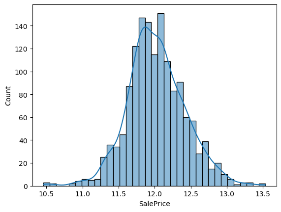
    


<h3>Models<h3>


```python
x = df.drop(columns="SalePrice")
y = df["SalePrice"]
```


```python

```


```python
from sklearn.model_selection import train_test_split
from sklearn.linear_model import LinearRegression

x_train, x_test, y_train, y_test = train_test_split(x,y, train_size=0.8, random_state=42)

linear_model = LinearRegression()
linear_model.fit(x_train,y_train)

```


    LinearRegression()


<h3>Model Evaluation</h3>


```python
y_pred = linear_model.predict(x_test)
```


```python
from sklearn.metrics import r2_score, mean_squared_error

r2 = r2_score(y_test,y_pred)
rmse = np.sqrt(mean_squared_error(y_test,y_pred))

print(f"R square score is: {r2:.5f}") # Variance of SalePrice
print(f"Root mean squared error is: {rmse:.5f}") 
```

    R square score is: 0.76767
    Root mean squared error is: 0.20822
    


```python
#Not by me
import matplotlib.pyplot as plt

plt.figure(figsize=(8, 6))
sns.scatterplot(x=y_test, y=y_pred)
plt.xlabel("Actual SalePrice")
plt.ylabel("Predicted SalePrice")
plt.title("Predicted vs Actual SalePrice (log)")
plt.plot([y_test.min(), y_test.max()], [y_test.min(), y_test.max()], 'r--')
plt.show()
```


    
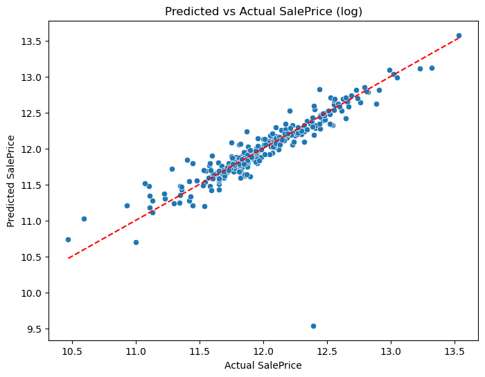
    


```python
#Actual SalePrice

y_test_act = np.exp(y_test)
y_pred_act = np.exp(y_pred)
```


```python
from sklearn.metrics import mean_absolute_error


r_square = r2_score(y_test_act, y_pred_act)
rmse = np.sqrt(mean_squared_error(y_test_act, y_pred_act))
mae = mean_absolute_error(y_test_act, y_pred_act)

print("r^2 score is: ", r_square)
print("Root mean squared error: ", rmse)
print("mean absulote error: ", mae)

```

    r^2 score is:  0.9131060586605331
    Root mean squared error:  25816.75571217061
    mean absulote error:  15506.134663416788
    


```python
plt.figure(figsize = (10,5))
plt.scatter(x=y_test_act, y=y_pred_act)
plt.title("Actual SalePrice")
plt.xlabel("Actual SalePrice")
plt.ylabel("Predicted SalePrice")
plt.plot([0,800000],[0,800000],'r--')
plt.show()
```


    
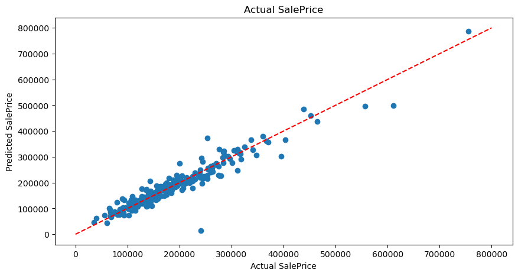
    


```python
# Let's see the most influencing features
pd.Series(index = x_train.columns, data= np.abs(linear_model.coef_)).sort_values().tail(10)
```


    GarageQual_Po       0.418435
    Functional_Sev      0.436247
    GarageCond_Po       0.439698
    Condition2_PosN     0.796051
    RoofMatl_Tar&Grv    2.614543
    RoofMatl_WdShake    2.622099
    RoofMatl_CompShg    2.622494
    RoofMatl_WdShngl    2.636569
    RoofMatl_Roll       2.700078
    RoofMatl_Metal      2.739458
    dtype: float64


<h1>Ridge and Lasso</h1>


```python
from sklearn.linear_model import Ridge, Lasso

ridge_model = Ridge()

ridge_model = ridge_model.fit(x_train, y_train)
y_pred = ridge_model.predict(x_test)
```


```python

plt.scatter(x=y_test, y=y_pred)
plt.xlabel("Actual SalePrice")
plt.ylabel("Predicted SalePrice")
plt.title("SalePrice using Ridge")
plt.plot([y_test.min(),y_test.max()],[y_pred.min(),y_pred.max()], "r--")
plt.show()


ridge_r2 = r2_score(y_test,y_pred)
ridge_rmse = np.sqrt(mean_squared_error(y_test,y_pred))

print("Ridge R square: ", ridge_r2)
print("Ridge root mean squared error: ", ridge_rmse)
```


    
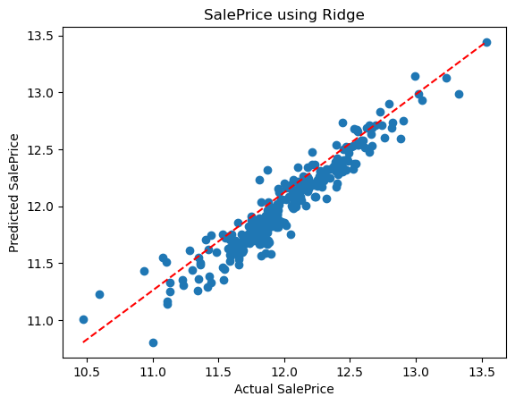
    


    Ridge R square:  0.9042156781502457
    Ridge root mean squared error:  0.13369610799634876
    

Better than normal linear regression


```python
lasso_model = Lasso()
lasso_model = lasso_model.fit(x_train,y_train)
y_pred = lasso_model.predict(x_test)
```


```python
plt.scatter(x=y_test, y=y_pred)
plt.xlabel("Actual SalePrice")
plt.ylabel("Predicted SalePrice")
plt.title("SalePrice using Lasso")
plt.plot([y_test.min(),y_test.max()],[y_pred.min(),y_pred.max()], "r--")
plt.show()


lasso_r2 = r2_score(y_test,y_pred)
lasso_rmse = np.sqrt(mean_squared_error(y_test,y_pred))

print("Lasso R square: ", lasso_r2)
print("Lasso root mean squared error: ", lasso_rmse)
```


    
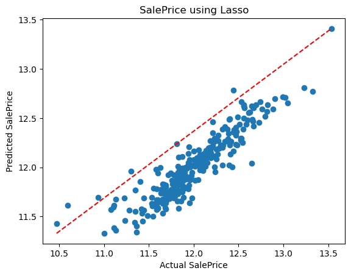
    


    Lasso R square:  0.801245354492175
    Lasso root mean squared error:  0.1925884307696814
    

Let's now try cross validation to find the best alpha


```python
from sklearn.linear_model import RidgeCV

ridge_model_cv = RidgeCV(alphas = [0.01,0.1,1,2,3], cv=5)
ridge_model_cv.fit(x_train,y_train)

print("Optimal alpha according to my cross validation is: ", ridge_model_cv.alpha_)
```

    Optimal alpha according to my cross validation is:  3.0
    


```python
df
```


<div>

<table border="1" class="dataframe">
  <thead>
    <tr style="text-align: right;">
      <th></th>
      <th>MSSubClass</th>
      <th>LotFrontage</th>
      <th>LotArea</th>
      <th>OverallQual</th>
      <th>OverallCond</th>
      <th>YearBuilt</th>
      <th>YearRemodAdd</th>
      <th>MasVnrArea</th>
      <th>BsmtFinSF1</th>
      <th>BsmtFinSF2</th>
      <th>...</th>
      <th>SaleType_ConLI</th>
      <th>SaleType_ConLw</th>
      <th>SaleType_New</th>
      <th>SaleType_Oth</th>
      <th>SaleType_WD</th>
      <th>SaleCondition_AdjLand</th>
      <th>SaleCondition_Alloca</th>
      <th>SaleCondition_Family</th>
      <th>SaleCondition_Normal</th>
      <th>SaleCondition_Partial</th>
    </tr>
  </thead>
  <tbody>
    <tr>
      <th>0</th>
      <td>60</td>
      <td>-0.220875</td>
      <td>8450</td>
      <td>7</td>
      <td>5</td>
      <td>2003</td>
      <td>2003</td>
      <td>0.514104</td>
      <td>706</td>
      <td>0</td>
      <td>...</td>
      <td>0</td>
      <td>0</td>
      <td>0</td>
      <td>0</td>
      <td>1</td>
      <td>0</td>
      <td>0</td>
      <td>0</td>
      <td>1</td>
      <td>0</td>
    </tr>
    <tr>
      <th>1</th>
      <td>20</td>
      <td>0.460320</td>
      <td>9600</td>
      <td>6</td>
      <td>8</td>
      <td>1976</td>
      <td>1976</td>
      <td>-0.570750</td>
      <td>978</td>
      <td>0</td>
      <td>...</td>
      <td>0</td>
      <td>0</td>
      <td>0</td>
      <td>0</td>
      <td>1</td>
      <td>0</td>
      <td>0</td>
      <td>0</td>
      <td>1</td>
      <td>0</td>
    </tr>
    <tr>
      <th>2</th>
      <td>60</td>
      <td>-0.084636</td>
      <td>11250</td>
      <td>7</td>
      <td>5</td>
      <td>2001</td>
      <td>2002</td>
      <td>0.325915</td>
      <td>486</td>
      <td>0</td>
      <td>...</td>
      <td>0</td>
      <td>0</td>
      <td>0</td>
      <td>0</td>
      <td>1</td>
      <td>0</td>
      <td>0</td>
      <td>0</td>
      <td>1</td>
      <td>0</td>
    </tr>
    <tr>
      <th>3</th>
      <td>70</td>
      <td>-0.447940</td>
      <td>9550</td>
      <td>7</td>
      <td>5</td>
      <td>1915</td>
      <td>1970</td>
      <td>-0.570750</td>
      <td>216</td>
      <td>0</td>
      <td>...</td>
      <td>0</td>
      <td>0</td>
      <td>0</td>
      <td>0</td>
      <td>1</td>
      <td>0</td>
      <td>0</td>
      <td>0</td>
      <td>0</td>
      <td>0</td>
    </tr>
    <tr>
      <th>4</th>
      <td>60</td>
      <td>0.641972</td>
      <td>14260</td>
      <td>8</td>
      <td>5</td>
      <td>2000</td>
      <td>2000</td>
      <td>1.366489</td>
      <td>655</td>
      <td>0</td>
      <td>...</td>
      <td>0</td>
      <td>0</td>
      <td>0</td>
      <td>0</td>
      <td>1</td>
      <td>0</td>
      <td>0</td>
      <td>0</td>
      <td>1</td>
      <td>0</td>
    </tr>
    <tr>
      <th>...</th>
      <td>...</td>
      <td>...</td>
      <td>...</td>
      <td>...</td>
      <td>...</td>
      <td>...</td>
      <td>...</td>
      <td>...</td>
      <td>...</td>
      <td>...</td>
      <td>...</td>
      <td>...</td>
      <td>...</td>
      <td>...</td>
      <td>...</td>
      <td>...</td>
      <td>...</td>
      <td>...</td>
      <td>...</td>
      <td>...</td>
      <td>...</td>
    </tr>
    <tr>
      <th>1455</th>
      <td>60</td>
      <td>-0.357114</td>
      <td>7917</td>
      <td>6</td>
      <td>5</td>
      <td>1999</td>
      <td>2000</td>
      <td>-0.570750</td>
      <td>0</td>
      <td>0</td>
      <td>...</td>
      <td>0</td>
      <td>0</td>
      <td>0</td>
      <td>0</td>
      <td>1</td>
      <td>0</td>
      <td>0</td>
      <td>0</td>
      <td>1</td>
      <td>0</td>
    </tr>
    <tr>
      <th>1456</th>
      <td>20</td>
      <td>0.687385</td>
      <td>13175</td>
      <td>6</td>
      <td>6</td>
      <td>1978</td>
      <td>1988</td>
      <td>0.087911</td>
      <td>790</td>
      <td>163</td>
      <td>...</td>
      <td>0</td>
      <td>0</td>
      <td>0</td>
      <td>0</td>
      <td>1</td>
      <td>0</td>
      <td>0</td>
      <td>0</td>
      <td>1</td>
      <td>0</td>
    </tr>
    <tr>
      <th>1457</th>
      <td>70</td>
      <td>-0.175462</td>
      <td>9042</td>
      <td>7</td>
      <td>9</td>
      <td>1941</td>
      <td>2006</td>
      <td>-0.570750</td>
      <td>275</td>
      <td>0</td>
      <td>...</td>
      <td>0</td>
      <td>0</td>
      <td>0</td>
      <td>0</td>
      <td>1</td>
      <td>0</td>
      <td>0</td>
      <td>0</td>
      <td>1</td>
      <td>0</td>
    </tr>
    <tr>
      <th>1458</th>
      <td>20</td>
      <td>-0.084636</td>
      <td>9717</td>
      <td>5</td>
      <td>6</td>
      <td>1950</td>
      <td>1996</td>
      <td>-0.570750</td>
      <td>49</td>
      <td>1029</td>
      <td>...</td>
      <td>0</td>
      <td>0</td>
      <td>0</td>
      <td>0</td>
      <td>1</td>
      <td>0</td>
      <td>0</td>
      <td>0</td>
      <td>1</td>
      <td>0</td>
    </tr>
    <tr>
      <th>1459</th>
      <td>20</td>
      <td>0.233255</td>
      <td>9937</td>
      <td>5</td>
      <td>6</td>
      <td>1965</td>
      <td>1965</td>
      <td>-0.570750</td>
      <td>830</td>
      <td>290</td>
      <td>...</td>
      <td>0</td>
      <td>0</td>
      <td>0</td>
      <td>0</td>
      <td>1</td>
      <td>0</td>
      <td>0</td>
      <td>0</td>
      <td>1</td>
      <td>0</td>
    </tr>
  </tbody>
</table>
<p>1460 rows × 233 columns</p>
</div>


<h1>Logistic Regression</h1>


```python
x = df.drop(columns=["SaleCondition_Normal"])
y = df["SaleCondition_Normal"]


x_train, x_test, y_train, y_test = train_test_split(x,y, train_size= 0.75, random_state=42)


scalar = StandardScaler()

x_train_scaled = scalar.fit_transform(x_train)
x_test_scaled = scalar.transform(x_test)
```


```python
from sklearn.linear_model import LogisticRegressionCV

logistic_model = LogisticRegressionCV(cv=5, max_iter=1000)

logistic_model = logistic_model.fit(x_train_scaled, y_train)

y_pred = logistic_model.predict(x_test_scaled)
```


```python
from sklearn.metrics import confusion_matrix, accuracy_score, classification_report


print("Accuracy is: ", accuracy_score(y_true=y_test, y_pred=y_pred))
print("Confusion Matrix:\n", confusion_matrix(y_test,y_pred))
print("Classification Report:\n", classification_report(y_test,y_pred))
```

    Accuracy is:  0.9178082191780822
    Confusion Matrix:
     [[ 48  27]
     [  3 287]]
    Classification Report:
                   precision    recall  f1-score   support
    
               0       0.94      0.64      0.76        75
               1       0.91      0.99      0.95       290
    
        accuracy                           0.92       365
       macro avg       0.93      0.81      0.86       365
    weighted avg       0.92      0.92      0.91       365
    
    


```python
from sklearn.tree import DecisionTreeClassifier

dt_model = DecisionTreeClassifier(max_depth=5, random_state=42)
dt_model.fit(x_train, y_train)
y_pred = dt_model.predict(x_test)
```


```python
print("Accuracy is: ", accuracy_score(y_true=y_test, y_pred=y_pred))
print("Confusion Matrix:\n", confusion_matrix(y_test,y_pred))
print("Classification Report:\n", classification_report(y_test,y_pred))
```

    Accuracy is:  0.9123287671232877
    Confusion Matrix:
     [[ 45  30]
     [  2 288]]
    Classification Report:
                   precision    recall  f1-score   support
    
               0       0.96      0.60      0.74        75
               1       0.91      0.99      0.95       290
    
        accuracy                           0.91       365
       macro avg       0.93      0.80      0.84       365
    weighted avg       0.92      0.91      0.90       365
    
    


```python
from sklearn.tree import plot_tree

plt.figure(figsize=(16,8))
plot_tree(dt_model,filled = True, feature_names=x_test.columns, class_names=["not Normal","Normal"])
plt.title("Normal Houses")
plt.show()
```


    
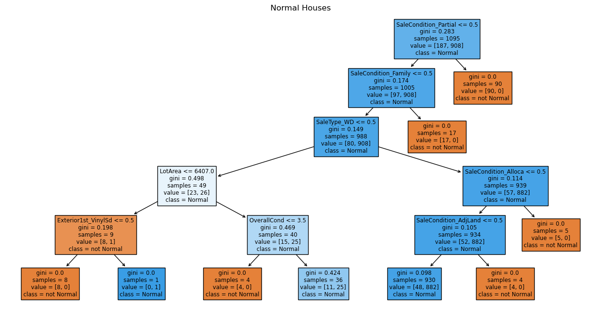
    


```python
from sklearn.ensemble import RandomForestClassifier


rf_model = RandomForestClassifier(n_estimators=120, random_state=42, max_depth=5)
rf_model.fit(x_train,y_train)
y_pred = rf_model.predict(x_test)
```


```python
print("Accuracy is: ", accuracy_score(y_true=y_test, y_pred=y_pred))
print("Confusion Matrix:\n", confusion_matrix(y_test,y_pred))
print("Classification Report:\n", classification_report(y_test,y_pred))
```

    Accuracy is:  0.8849315068493151
    Confusion Matrix:
     [[ 33  42]
     [  0 290]]
    Classification Report:
                   precision    recall  f1-score   support
    
               0       1.00      0.44      0.61        75
               1       0.87      1.00      0.93       290
    
        accuracy                           0.88       365
       macro avg       0.94      0.72      0.77       365
    weighted avg       0.90      0.88      0.87       365
    
    


```python
#Most important Features
pd.Series(rf_model.feature_importances_,x_test.columns).sort_values(ascending=False).head(20)
```


    SaleCondition_Partial    0.162700
    SaleType_New             0.159413
    SaleType_WD              0.149528
    YearBuilt                0.072274
    GarageYrBlt              0.055950
    SaleCondition_Family     0.037377
    YearRemodAdd             0.033783
    SalePrice                0.022855
    GarageArea               0.015873
    LotFrontage              0.014373
    GarageCars               0.013899
    BsmtFinSF1               0.010927
    BsmtUnfSF                0.010180
    TotalBsmtSF              0.010162
    OpenPorchSF              0.009927
    YrSold                   0.008362
    MoSold                   0.008009
    GrLivArea                0.007582
    SaleCondition_Alloca     0.007495
    OverallCond              0.007422
    dtype: float64


```python

```
<h2>Results</h2>

<p>So now let's summrise our findings in <strong>Regression</strong> models and <strong>classifcation</strong> models</p>

<h3>Regression Results – Predicting House Sale Price</h3>

<table>
  <thead>
    <tr>
      <th>Model</th>
      <th>R² Score</th>
      <th>RMSE (log scale)</th>
    </tr>
  </thead>
  <tbody>
    <tr>
      <td>Linear Regression</td>
      <td>0.76767</td>
      <td>0.20822</td>
    </tr>
    <tr>
      <td><strong>Ridge Regression</strong></td>
      <td><strong>0.9042</strong></td>
      <td><strong>0.1337</strong></td>
    </tr>
    <tr>
      <td>Lasso Regression</td>
      <td>0.8012</td>
      <td>0.1926</td>
    </tr>
  </tbody>
</table>

<p><strong>Ridge Regression</strong> performed better than the other two models as it had the lowest RMSE and the highest R².</p>

<h4>Most Influencing Features for Linear Models</h4>
<ul>
  <li>RoofMatl_Metal</li>
  <li>RoofMatl_Roll</li>
  <li>RoofMatl_WdShngl</li>
  <li>RoofMatl_CompShg</li>
  <li>RoofMatl_WdShake</li>
</ul>

<h3>Classification Results – Predicting SaleCondition: Normal</h3>

<table>
  <thead>
    <tr>
      <th>Model</th>
      <th>Accuracy</th>
      <th>Precision (Normal)</th>
      <th>Recall (Normal)</th>
      <th>F1-Score (Normal)</th>
    </tr>
  </thead>
  <tbody>
    <tr>
      <td><strong>Logistic Regression</strong></td>
      <td><strong>0.918</strong></td>
      <td>0.91</td>
      <td><strong>0.99</strong></td>
      <td><strong>0.95</strong></td>
    </tr>
    <tr>
      <td>Decision Tree (depth=5)</td>
      <td>0.912</td>
      <td>0.91</td>
      <td>0.99</td>
      <td>0.95</td>
    </tr>
    <tr>
      <td>Random Forest (depth=5)</td>
      <td>0.885</td>
      <td>1.00</td>
      <td>0.44</td>
      <td>0.61</td>
    </tr>
  </tbody>
</table>

<p><strong>Logistic Regression</strong> had the best balance of precision and recall.</p>
<p><strong>Decision Tree</strong> results are the same as Logistic Regression with neglectable difference in accuracy</p>
<strong>Random Forest</strong> had perfect precision but had low recall.</p>

<h4>Top Features in Random Forest</h4>
<ul>
  <li>SaleCondition_Partial</li>
  <li>SaleType_New</li>
  <li>SaleType_WD</li>
  <li>YearBuilt</li>
  <li>GarageYrBlt</li>
</ul>
